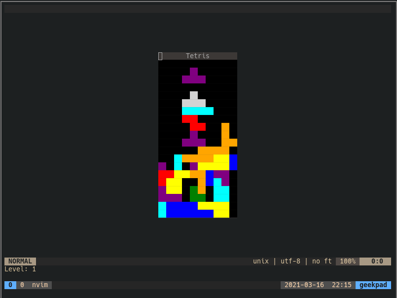

# nvim-tetris
Bringing emacs' greatest feature to neovim - Tetris!

This plugin is written in [Fennel](https://fennel-lang.org/) using Olical's project [Aniseed](https://github.com/Olical/aniseed) for creating the project structure, and as a library of helper functions and macros. The game compiles to Lua and uses Neovim API functions, so Vim support is not currently a goal.

nvim-tetris is a work-in-progress, and is not feature complete.

## How To Install
- Prerequisites: neovim
- You can install the plugin just like any other Neovim plugin. I personally use [vim-plug](https://github.com/junegunn/vim-plug).
- Another way to install would be to just clone this repo into `~/.local/share/nvim/site/pack/*/start/`, where `*` is whatever you choose (I use "alec").
- After installing, you can launch a game of Tetris using the `:Tetris` command inside Neovim.
- If your colours look weird, ensure you are using a terminal which supports true colour, you have configured tmux for true colour support if you are using tmux, and you have the `termguicolors` option enabled in Neovim.

## Controls
- Left Arrow: move left
- Right Arrow: move right
- Up Arrow: rotate piece
- Down Arrow: soft drop
- Space Bar: hard drop

## What Works
- Core game functions including controlling the current piece, clearing lines, and gameover when you run out of space
- Piece shadow showing where the current piece will land
- Level progression - you progress a level every 10 lines cleared, and the game gets faster with each level
- Short delays when the piece appears and when it locks. The locking delay resets when rotating or moving your piece, to make gameplay more fun at high speeds
- Correct rotation behaviour including wall-kicks according to "How Guideline SRS Really Works" from https://harddrop.com/wiki/SRS (this means T-spins work)

## Next Steps
- Add border showing current level, current score, next piece, saved piece (and add logic for saving pieces)
- Add pause screen (with options to resume game, start new game or quit)
- Add game over screen (with options to play again or quit)
- Add intro screen which shows controls
- Add logic for score
- Configuration
- Documentation
- Tests
- Stretch goals: music, leaderboards?, ...
